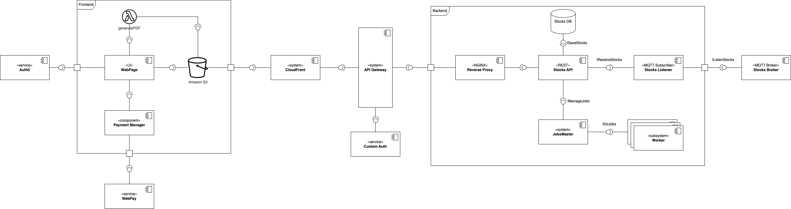

# Diagrama UML y Explicación

A continuación, se presenta el diagrama UML desarrollado para nuestra app:

El diagrama tiene diversos componentes y bloques. Primero comenzaremos con el Backend, que contiene la API que controla la lógica de la aplicación. Esta se conecta al exterior a traves del componente nginx. Por dentro, la API esta conectada a la base de datos y a un listener MQTT. Este listener escucha el estado de los stocks y las validaciones de las compras. Además, se encuentra conectado a un broker externo de donde se recibe la información. Por otro lado, la API se conecta a un componente JobsMaster que gestiona la utilización de workers para ciertas tareas.

El Back se conecta a una API Gateway, la cual además se conecta a CloudFront, un CDN que permite que la aplicación sea más rápida. También, hay un custom Authorizer que se conecta a la API Gateway y que permite separar la lógica de authentificación de la API. A CloudFront se conecta un componente S3 con el Frontend de la aplicación. Dentro del frontend podemos identificar conexiones a componentes habilitadores del servicio Transbank, como también una función AWS Lambda que se encarga de la generación de las boletas. Finamente, se usa un componente externo Auth0 para manejar la authentificación de los usuarios.
